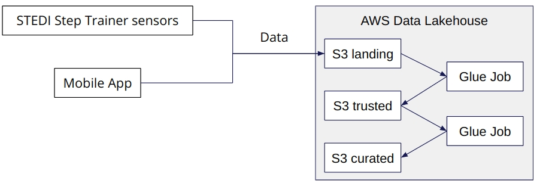

# STEDI-Human-Balance-Analytics

# Project Overview
Extracted the data produced by the STEDI Step Trainer sensors and the mobile app, and curate them into a data lakehouse solution on AWS so that Data Scientists can train the learning model.

# Technology Used

-AWS S3
-AWS IAM 
     -Roles
-AWS Glue
     -AWS Glue visual ETL
     -AWS Glue Database
     -AWS Glue Data Catalogue
          -Tables
-AWS Athena 
     -Query Editor

# Project Workflow

# Project Data
STEDI has three JSON data sources(opens in a new tab) to use from the Step Trainer. Check out the JSON data in the following folders in the Github repo:

-customer
-step_trainer
-accelerometer

#Here are the steps to download the data:

Extract the zip file.

956 rows in the customer_landing table,
81273 rows in the accelerometer_landing table, and
28680 rows in the step_trainer_landing table.

1. Customer Records
This is the data from fulfillment and the STEDI website.
AWS S3 Bucket URI - s3://cd0030bucket/customers/
contains the following fields:

-serialnumber
-sharewithpublicasofdate
-birthday
-registrationdate
-sharewithresearchasofdate
-customername
-email
-lastupdatedate
-phone
-sharewithfriendsasofdate

2. Step Trainer Records

This is the data from the motion sensor.Data Download URL(opens in a new tab)
AWS S3 Bucket URI - s3://cd0030bucket/step_trainer/

contains the following fields:

-sensorReadingTime
-serialNumber
-distanceFromObject

3. Accelerometer Records
This is the data from the mobile app.Data Download URL(opens in a new tab)
AWS S3 Bucket URI - s3://cd0030bucket/accelerometer/

contains the following fields:

-timeStamp
-user
-x
-y
-z

#Steps 
-Created S3 Bucket uploaded those 3 Data sets
-Assigned Iam role for glue
-Created glue tables manually and designed Schema such as assigning data types to each columns
-verified data using athena to proceed further for the glue job
-As we need to collect data from the people who agrees to that need to be seprated for using Anlytical purpose by Data scientist 
-So we create a glue job to filter out the cistomer who agrees to collect

-The Data Science team has done some preliminary data analysis and determined that the Accelerometer Records each match one of the Customer Records. created 2 AWS Glue Jobs that do the following:

1.Sanitize the Customer data from the Website (Landing Zone) and only store the Customer Records who agreed to share their data for research purposes (Trusted Zone) - creating a Glue Table called customer_trusted.

SELECT *
FROM customer_landing
WHERE sharewithresearchasofdate IS NOT NULL

2.Sanitize the Accelerometer data from the Mobile App (Landing Zone) - and only store Accelerometer Readings from customers who agreed to share their data for research purposes (Trusted Zone) - creating a Glue Table called accelerometer_trusted.

SELECT accelerometer.*
FROM accelerometer
JOIN customer
ON accelerometer.user = customer.email

Sanitize the Customer data (Trusted Zone) and create a Glue Table (Curated Zone) that only includes customers who have accelerometer data and have agreed to share their data for research called customers_curated.

SELECT DISTINCT customer.*
FROM customer
JOIN accelerometer
ON customer.email = accelerometer.user

Finally, you need to create two Glue Studio jobs that do the following tasks:

Read the Step Trainer IoT data stream (S3) and populate a Trusted Zone Glue Table called step_trainer_trusted that contains the Step Trainer Records data for customers who have accelerometer data and have agreed to share their data for research (customers_curated).

SELECT step.*
FROM step
WHERE step.serialNumber IN (
    SELECT serialNumber
    FROM customer
)

Created an aggregated table that has each of the Step Trainer Readings, and the associated accelerometer reading data for the same timestamp, but only for customers who have agreed to share their data, and make a glue table called machine_learning_curated.

SELECT *
FROM step
JOIN accel
ON step.sensorReadingTime = accel.timestamp

# Conclusion

This is an End to End data pipline project where i have seeked,understood knowledge on the concepts including data lakes , ETL and Data processing.

the row count in the produced table is verified using Athena 

Landing
Customer: 956
Accelerometer: 81273
Step Trainer: 28680

Trusted
Customer: 482
Accelerometer: 40981
Step Trainer: 14460

Curated
Customer: 482
Machine Learning: 43681